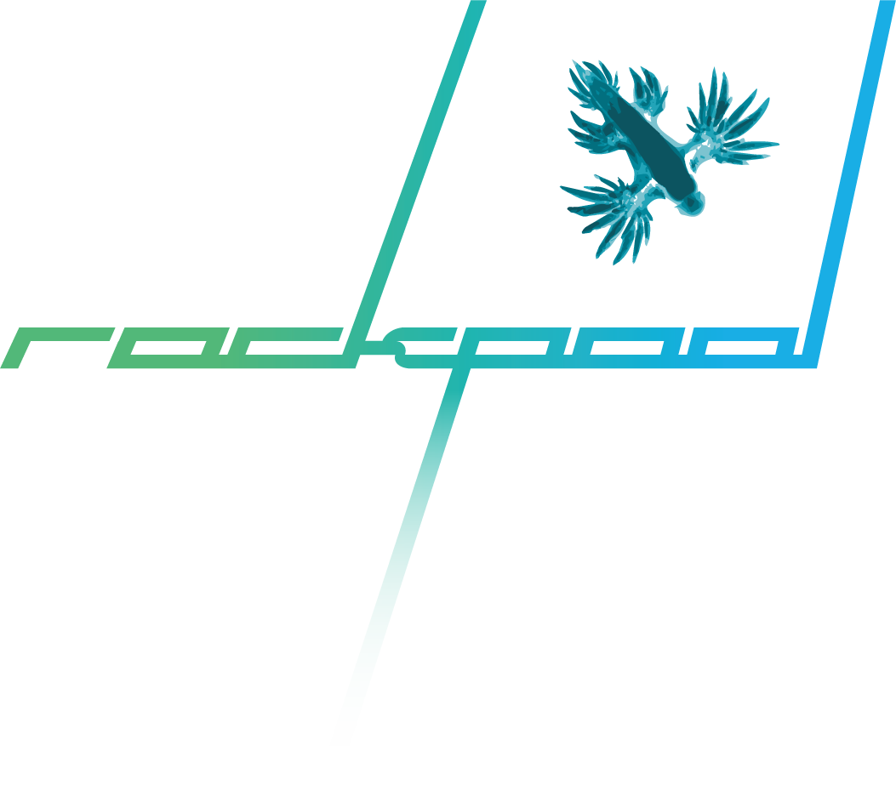
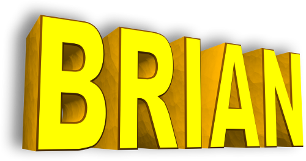
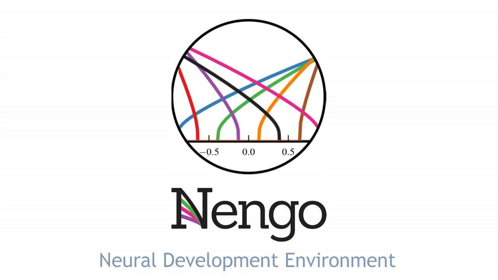
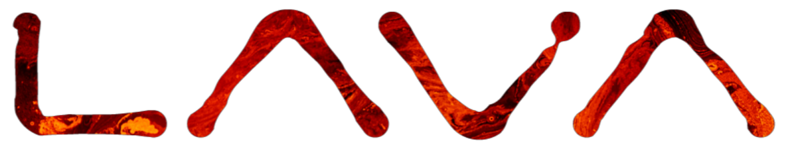
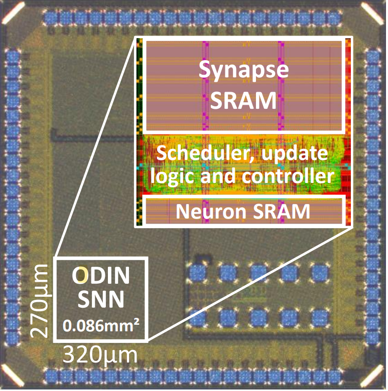
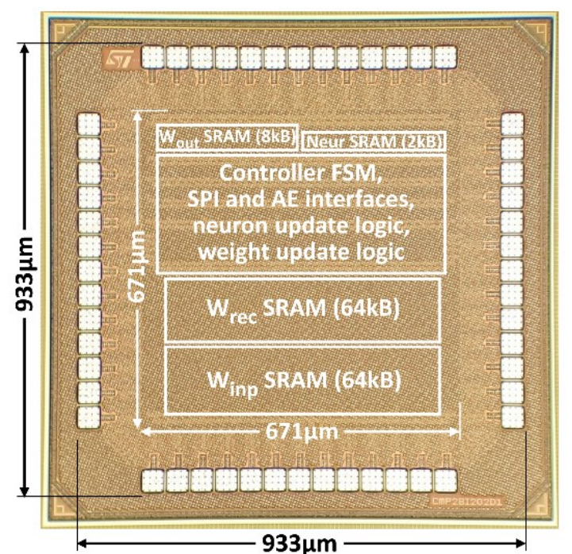
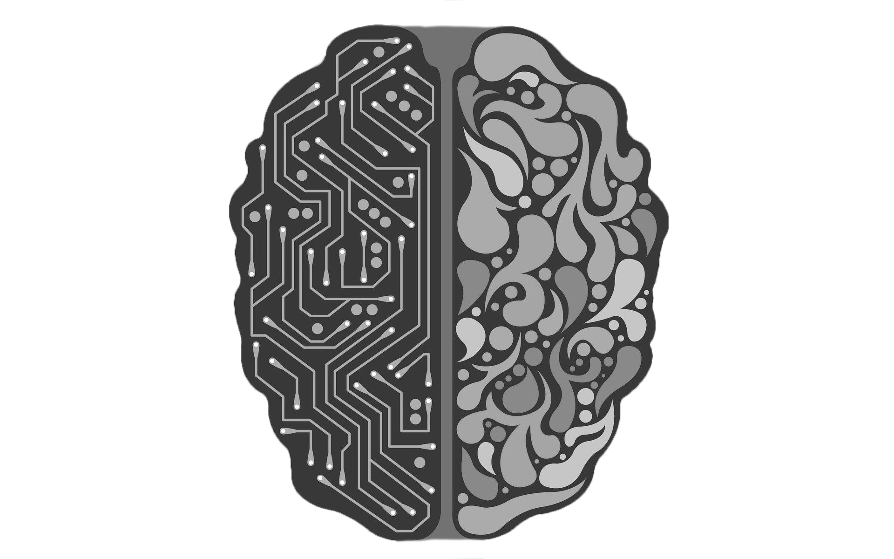
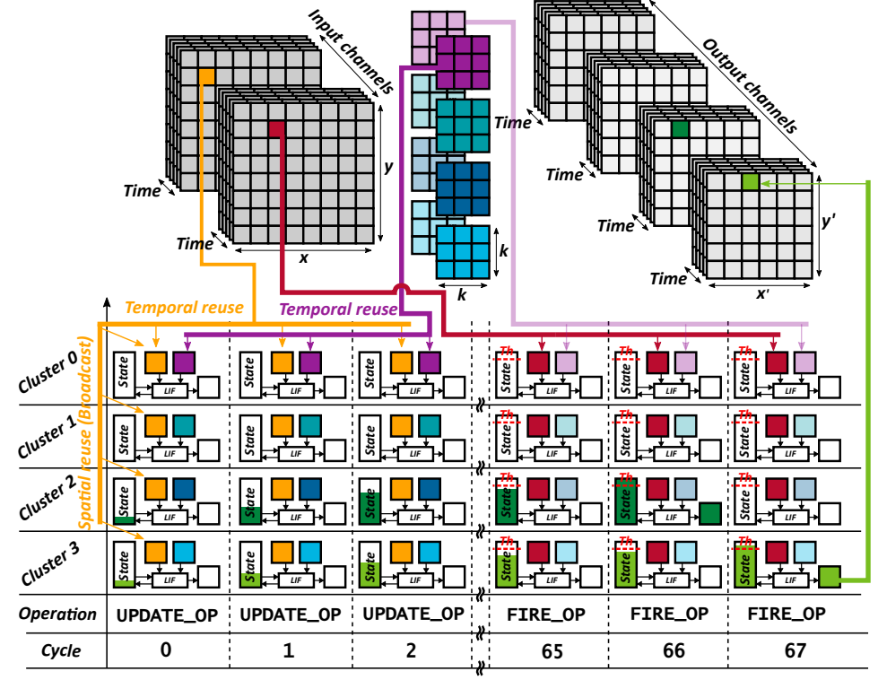
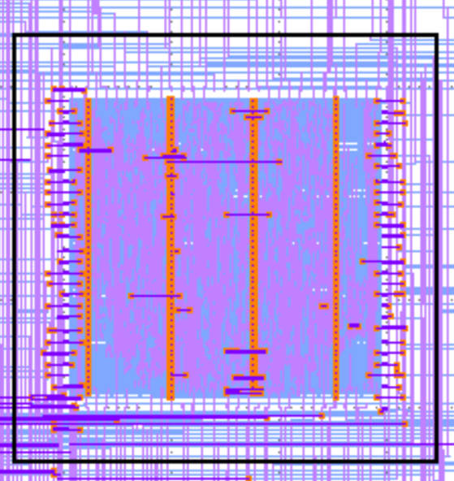
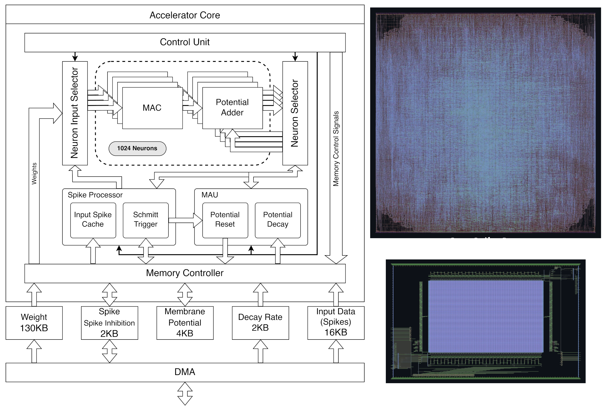

# <a href="https://open-neuromorphic.org">Open Neuromorphic</a>

Open Neuromorphic (ONM) is a global community fostering education, research, and open-source collaboration in brain-inspired AI and hardware. Our goal is to build a vibrant and accessible ecosystem for everyone interested in neuromorphic computing, from beginners to experts.

**What We Offer:**

*   **Resource Hubs:** Explore our curated guides to [Neuromorphic Hardware](https://open-neuromorphic.org/neuromorphic-computing/hardware/) and [Software](https://open-neuromorphic.org/neuromorphic-computing/software/), designed to help you navigate the landscape and find the right tools for your projects.
*   **Community Events:** Participate in our workshops, student talks, and hacking hours to learn from experts, share your work, and collaborate on real-world challenges.
*   **A Collaborative Platform:** Join over 2,000 members on our [Discord server](https://discord.gg/JParSCNe5k) for discussions, Q&A, and networking. 

We welcome contributions of all kinds. To learn how you can participate, visit our [Getting Involved page](https://open-neuromorphic.org/getting-involved/).

# List of resources

## SNN training frameworks for ML

Open-source software to train spiking neural networks for ML tasks.

<table>

<tr>
<td>

</td>
<td>

[BindsNET](https://open-neuromorphic.org/neuromorphic-computing/software/snn-frameworks/bindsnet/) is built on top of the PyTorch deep learning platform. It is used for the simulation of spiking neural networks (SNNs) and is geared towards machine learning and reinforcement learning.

</td>
</tr>

<tr>
<td>

</td>
<td>

[Norse](https://open-neuromorphic.org/neuromorphic-computing/software/snn-frameworks/norse/) aims at exploiting the advantages of bio-inspired neural components, which are sparse and event-driven - a fundamental difference from artificial neural networks. Norse expands PyTorch with primitives for bio-inspired neural components, bringing you two advantages: a modern and proven infrastructure based on PyTorch and deep learning-compatible spiking neural network components.

</td>
</tr>

<tr>
<td>

</td>
<td>

[Rockpool](https://open-neuromorphic.org/neuromorphic-computing/software/snn-frameworks/rockpool/) is a Machine Learning library for SNN applications. Design, train and test with GPU, TPU and CPU acceleration (based on PyTorch and Jax), then deploy to Neuromorphic compute hardware. Offers a convenient Torch-like API, and extensive documentation.
</td>
</tr>

<tr>
<td>

</td>
<td>

[snnTorch](https://open-neuromorphic.org/neuromorphic-computing/software/snn-frameworks/snntorch/) is a SNN training framework for machine learning applications. It is focused on gradient-based training of SNNs. 
It is based on PyTorch for GPU acceleration and gradient computation.

</td>
</tr>

<tr>
<td>

 </td>

<td>

[Spyx](https://open-neuromorphic.org/neuromorphic-computing/software/snn-frameworks/spyx/) is a compact spiking neural network package built on top of DeepMind's Haiku library. Based on JAX, it permits Just-In-Time compilation of partial or entire training loops for maximal utilization on GPUs and TPUs.

</td>
</tr>

<tr>
<td>

</td>
<td>

[SpikingJelly](https://open-neuromorphic.org/neuromorphic-computing/software/snn-frameworks/spikingjelly/) is an open-source deep learning framework for Spiking Neural Network (SNN) based on PyTorch.
The documentation of SpikingJelly is written in both English and Chinese: https://spikingjelly.readthedocs.io.

</td>
</tr>

<tr>
<td>

</td>
<td>

[Sinabs](https://open-neuromorphic.org/neuromorphic-computing/software/snn-frameworks/sinabs/) is a deep learning library based on PyTorch for spiking neural networks, with a focus on simplicity, fast training and extendability. Sinabs works well for Vision models because of its support for weight transfer.

</td>
</tr>

</table>

## SNN training frameworks for neuroscience

Open-source software to train spiking neural networks. In these the tools, the goal is to emulate the human brain as efficiently as possible, instead of optimizing neuron model and simulation for speeding up AI tasks.

<table>
<tr>
<td>

</td>
<td>

[Brian](https://open-neuromorphic.org/neuromorphic-computing/software/snn-frameworks/brian/) is a free, open source simulator for spiking neural networks. It is written in the Python programming language and is available on almost all platforms. We believe that a simulator should not only save the time of processors, but also the time of scientists. Brian is therefore designed to be easy to learn and use, highly flexible and easily extensible.

</td>
</tr>

<tr>
<td>

</td>
<td>
 
[NEST](https://open-neuromorphic.org/neuromorphic-computing/software/snn-frameworks/nest/) is a simulator for spiking neural network models that focuses on the dynamics, size and structure of neural systems rather than on the exact morphology of individual neurons. The development of NEST is coordinated by the NEST Initiative.

NEST is ideal for networks of spiking neurons of any size, for example:

- models of information processing e.g. in the visual or auditory cortex of mammals,
- models of network activity dynamics, e.g. laminar cortical networks or balanced random networks,
- models of learning and plasticity.
</td>
</tr>

</table>

## SNN training frameworks for ML and neuroscience
Open-source software to train spiking neural networks for both neuroscience and ML applications.

<table>

<tr>
<td>

</td>
<td>

[Nengo](https://open-neuromorphic.org/neuromorphic-computing/software/snn-frameworks/nengo/) is a Python package for building, testing, and deploying neural networks.
It supports plenty of backends for the SNN simulation.

</td>
</tr>

<tr>
<td>

</td>
<td>

[Lava](https://open-neuromorphic.org/neuromorphic-computing/software/snn-frameworks/lava/) is an open-source software framework for developing neuro-inspired applications and mapping them to neuromorphic hardware. Lava provides developers with the tools and abstractions to develop applications that fully exploit the principles of neural computation. Constrained in this way, like the brain, Lava applications allow neuromorphic platforms to intelligently process, learn from, and respond to real-world data with great gains in energy efficiency and speed compared to conventional computer architectures.

</td>
</tr>

</table>

## Event-based data utilities

Open-source software to handle event-based data, including data generated by dynamic vision sensors and other neuromorphic sensors.

<table>

<tr>
<td>

</td>
<td>

[Tonic](https://open-neuromorphic.org/neuromorphic-computing/software/data-tools/tonic/) is a tool to facilitate the download, manipulation and loading of event-based/spike-based data. It's like PyTorch Vision but for neuromorphic data!

</td>
</tr>

<tr>
<td>

</td>
<td>

[expelliarmus](https://open-neuromorphic.org/neuromorphic-computing/software/data-tools/expelliarmus/) is a Python/C package to decode binary files produced by Prophesee cameras. 

</td>
</tr>

<tr>
<td>

</td>
<td>

[AEStream](https://open-neuromorphic.org/neuromorphic-computing/software/data-tools/aestream/) parses event-based dynamic-vision system (DVS) data from an input source and streams it to a sink (GPU, CPU, network ports...).

</td>
</tr>

<tr>
<td>

</td>
<td>

[AEDAT](https://open-neuromorphic.org/neuromorphic-computing/software/data-tools/aedat/) is a fast AEDAT 4 python reader, with an implementation written in Rust.
</td>
</tr>

<tr>
<td>

</td>
<td>

[BIMVEE](https://github.com/event-driven-robotics/bimvee) is an open-source python library for Batch Import, Manipulation, Visualisation and Export of Events etc. It has import routines for several different event formats including, notably, a python-native unpacker of rpg-rosbags (no ROS installation required). It imports event data together with bundled data such as rgb images, point-clouds, IMU etc, handling timestamp synchronisation. It has visualisers with intuitive defaults, allowing quick visualisation of the contents of event-data containers, and it has export routines for several data formats. Manipulations include time-stamp re-alignments, spatial cropping and event filtering. 

</td>
</tr>

<tr>
<td>

</td>
<td>

[MUSTARD](https://github.com/event-driven-robotics/mustard) is an open-source python application for playback of multistream data, including event-camera data. Each data stream present in a container (such as rosbag, but it can import any data-type which BIMVEE supports) opens a visualiser sub-window and data playback of all visualisers is controlled globally, including the speed, direction and time-window of visualisation. It has visualisers for events, rgb images, 6-DOF poses, point-clouds, depth maps etc. 

</td>
</tr>

</table>

## Digital hardware projects

Open-source digital hardware projects. 

### ODIN Spiking Neural Network (SNN) Processor

[ODIN](https://open-neuromorphic.org/neuromorphic-computing/hardware/odin-frenkel/) is an online-learning digital spiking neuromorphic processor designed and prototyped in 28-nm FDSOI CMOS at Université catholique de Louvain (UCLouvain), published in 2019 in the IEEE Transactions on Biomedical Circuits and Systems journal. ODIN is based on a single 256-neuron 64k-synapse crossbar neurosynaptic core with the following key features:

- synapses embed spike-dependent synaptic plasticity (SDSP)-based online learning,
- neurons can phenomenologically reproduce the 20 Izhikevich behaviors.

ODIN is thus a versatile experimentation platform for learning at the edge, while demonstrating (i) record neuron and synapse densities compared to all previously-proposed spiking neural networks (SNNs) and (ii) the lowest energy per synaptic operation across previously-proposed digital SNNs.

### ReckOn: A Spiking RNN Processor Enabling On-Chip Learning over Second-Long Timescales

[ReckOn](https://open-neuromorphic.org/neuromorphic-computing/hardware/reckon-frenkel/) is a spiking recurrent neural network (RNN) processor enabling on-chip learning over second-long timescales based on a modified version of the e-prop algorithm (we released a PyTorch implementation of the vanilla e-prop algorithm for leaky integrate-and-fire neurons here). It was prototyped and measured in 28-nm FDSOI CMOS at the Institute of Neuroinformatics, University of Zurich and ETH Zurich, and published at the 2022 IEEE International Solid-State Circuits Conference (ISSCC) with the following three main claims:

- ReckOn demonstrates end-to-end on-chip learning over second-long timescales while keeping a milli-second temporal resolution,
- it provides a low-cost solution with a 0.45-mm² core area, 5.3pJ/SOP at 0.5V, and a memory overhead of only 0.8% compared to the equivalent inference-only network,
- it exploits a spike-based representation for task-agnostic learning toward user customization and chip repurposing at the edge.

### RANC - Reconfigurable Architecture for Neuromorphic Computing

[RANC](https://ua-rcl.github.io/projects/ranc/) is a highly flexible environment that enables rapid experimentation with neuromorphic architectures in both software via C++ simulation and hardware via FPGA emulation. RANC enables hardware architects and application engineers to investigate and tune parameters of their neuromorphic architecture that would otherwise be unavailable on a purely prefabricated ASIC. This level of flexibility creates an environment that allows for optimizing architectures based on application insights as well as prototyping future neuromorphic architectures that can support new classes of applications entirely.

### SNE: an Energy-Proportional Digital Accelerator for Sparse Event-Based Convolutions 

[SNE](https://github.com/pulp-platform/sne) is a novel digital sparse neural engine (SNE) to efficiently accelerate SNN inference tasks at the extreme edge. The accelerator exploits an explicit input event temporal and spatial location encoding; the SNE architecture is designed to improve input data and weight reuse, reducing the traffic towards the memory. SNE achieves a maximum performance of 51.2 GSOP/s, and an energy efficiency of 4.5TSOP/s/W. Ultimately, SNE shows 3.55X higher energy efficiency than SoA neuromorphic platform [16], approaching classical DNN accelerators energy efficiencies, while performing energy-proportional computations. As a proof of concept, it is shown that SNE consumes 0.221 pJ/SOP and achieves 92.8% accuracy on a classification task performed on the IBM DVS-Gesture data set. 

### A Lightweight Spiking Neural Network Accelerator [Google Shuttle]

[A spiking neural network accelerator](https://github.com/jeshraghian/snn-accelerator) in the SkyWater 130nm process using heterogenous time constants to model a variety of temporal dynamics. Input events can be streamed at a rate of up to 50 MEvents per second, and the accelerator can process them in a dense network with 128 hidden neurons at up to approximately 214 MHz.

### SNN ASIC accelerator [Google Shuttle]

An [SNN ASIC](https://github.com/pengzhouzp/wrapped_snn_network) with adaptive threshold neurons and recurrent connective synapses.

### OpenSpike: An OpenRAM SNN AcceleratorOpenSpike

This paper presents a spiking neural network (SNN) accelerator made using fully open-source EDA tools, process design kit (PDK), and memory macros synthesized using OpenRAM. The chip is taped out in the 130 nm SkyWater process and integrates over 1 million synaptic weights, and offers a reprogrammable architecture. It operates at a clock speed of 40 MHz, a supply of 1.8 V, uses a PicoRV32 core for control, and occupies an area of 33.3 mm^2. The throughput of the accelerator is 48,262 images per second with a wallclock time of 20.72 us, at 56.8 GOPS/W. The spiking neurons use hysteresis to provide an adaptive threshold (i.e., a Schmitt trigger) which can reduce state instability. This results in high performing SNNs across a range of benchmarks that remain competitive with state-of-the-art, full precision SNNs. The design is open source and [available online](https://github.com/sfmth/OpenSpike).
