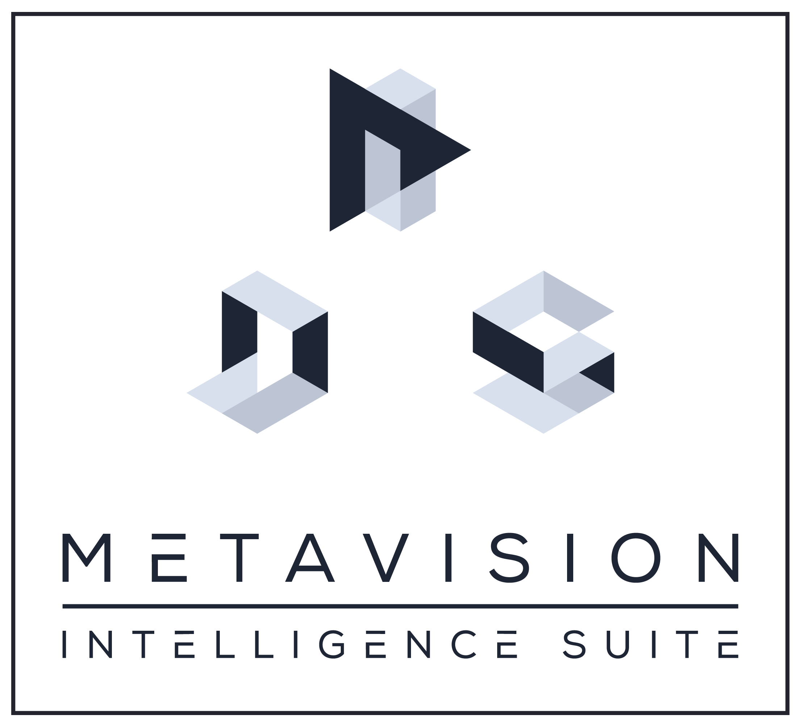

# Dynamic vision sensors utilities

Open-source software to handle data generated by event-based cameras.

## Tonic

[Tonic](https://github.com/neuromorphs/tonic) is a tool to facilitate the download, manipulation and loading of event-based/spike-based data. It's like PyTorch Vision but for neuromorphic data!

## expelliarmus 

[expelliarmus](https://github.com/fabhertz95/expelliarmus) is a Python/C package to decode binary files produced by Prophesee cameras. 

## AEStream - Address Event streaming library

[AEStream](https://github.com/norse/aestream) parses event-based dynamic-vision system (DVS) data from an input source and streams it to a sink (GPU, CPU, network ports...).

## AEDAT

[AEDAT](https://github.com/open-neuromorphic/aedat) is a fast AEDAT 4 python reader, with a Rust underlying implementation.

## OpenEB

[OpenEB](https://github.com/prophesee-ai/openeb) is the open source project associated with [Metavision Intelligence](https://www.prophesee.ai/metavision-intelligence/).

It enables anyone to get a better understanding of event-based vision, directly interact with events and build their own applications or plugins. As a camera manufacturer, ensure your customers benefit from the most advanced event-based software suite available by building your own plugin. As a creator, scientist, academic, join and contribute to the fast-growing event-based vision community.
