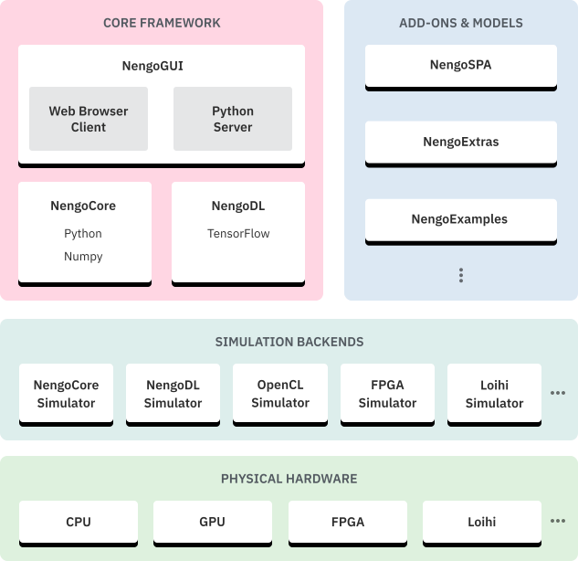

# SNN training frameworks

Open-source software to train spiking neural networks for both neuroscience and ML applications.

## Nengo

[Nengo](https://nengo.ai) is a Python package for building, testing, and deploying neural networks.

It supports plenty of backends for the SNN simulation.

## Lava

[Lava](https://lava-nc.org/) is an open-source software framework for developing neuro-inspired applications and mapping them to neuromorphic hardware. Lava provides developers with the tools and abstractions to develop applications that fully exploit the principles of neural computation. Constrained in this way, like the brain, Lava applications allow neuromorphic platforms to intelligently process, learn from, and respond to real-world data with great gains in energy efficiency and speed compared to conventional computer architectures.
